# Installing Jenkins on Azure VM 

## Pre-requisite

Virtual Machine on Azure with following Configuration

1. Open ports : 80, 22
1. Credentials : Either Password or SSH Keys
1. VM Size : Min 2 CPU and 8 GB of RAM

> You might try same configuration on ANY other cloud like AWS or GCP as well.

## Installing Jenkins as Service with NGINX as reverse proxy.

1.  Access the Azure VM using any one of the ssh client.

    -   Windows Terminal
    -   Windows Command Prompt
    -   Git Bash
    -   PuTTY

    > Example : Connecting with SSH Keys

    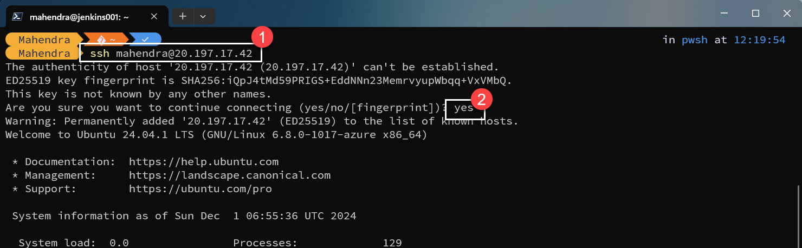

1.  Once connected, you need to install `Open-JDK-17` 

    ```bash
    sudo apt update -y
    sudo apt install openjdk-17-jdk-headless -y
    ```

1.  Set the Official APT Repository for Jenkins and install the required GPG Keys

    ```bash
    sudo wget -O /usr/share/keyrings/jenkins-keyring.asc \
        https://pkg.jenkins.io/debian-stable/jenkins.io-2023.key
    echo "deb [signed-by=/usr/share/keyrings/jenkins-keyring.asc]" \
        https://pkg.jenkins.io/debian-stable binary/ | sudo tee \
        /etc/apt/sources.list.d/jenkins.list > /dev/null
    ```

    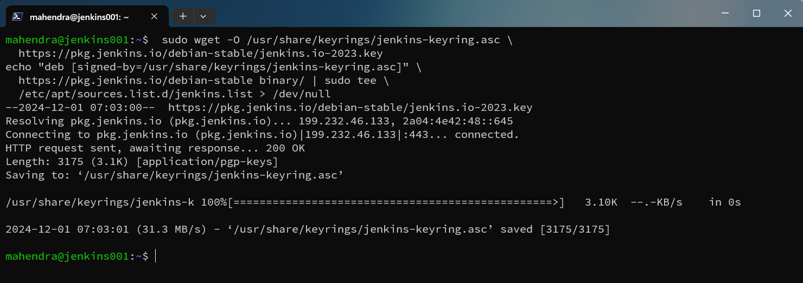

1.  Update the package cache and then install Jenkins.

    ```bash
    sudo apt update -y
    sudo apt install jenkins -y
    ```

1.  Verify the status of jenkins service using `systemd` daemon.

    ```bash
    sudo systemctl status jenkins
    ```

    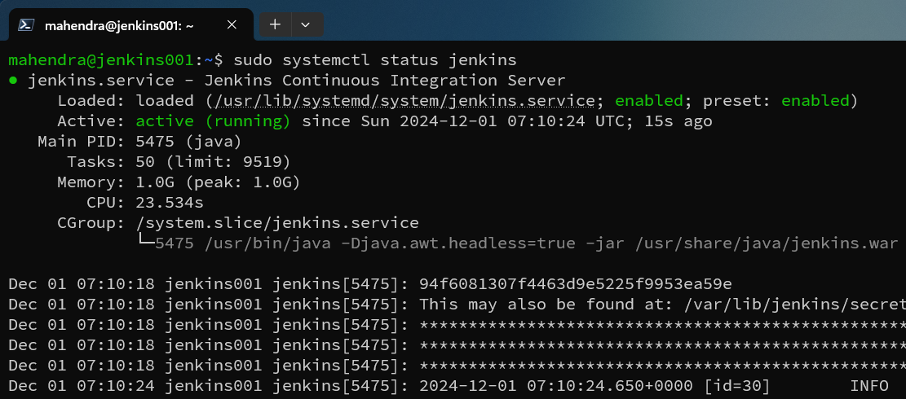

1.  Now, you need to install and setup `nginx` as a reverse proxy.

    ```
    sudo apt install nginx -y
    cd /etc/nginx/sites-available
    sudo cp default default.old
    sudo vi default
    ```

1.  Inside VIM editor, the `default` configuration should be visible. Delete all the lines from the file and replace them with following code.

    ```yml
    upstream jenkins {
        keepalive 32; # keepalive connections
        server 127.0.0.1:8080; # jenkins ip and port
    }

    # Required for Jenkins websocket agents
    map $http_upgrade $connection_upgrade {
    default upgrade;
    '' close;
    }

    server {
    listen          80;       # Listen on port 80 for IPv4 requests

    server_name     jenkins.example.com;  # replace 'jenkins.example.com' with your server domain name

    # this is the jenkins web root directory
    # (mentioned in the output of "systemctl cat jenkins")
    root            /var/run/jenkins/war/;

    access_log      /var/log/nginx/jenkins.access.log;
    error_log       /var/log/nginx/jenkins.error.log;

    # pass through headers from Jenkins that Nginx considers invalid
    ignore_invalid_headers off;

    location ~ "^/static/[0-9a-fA-F]{8}\/(.*)$" {
        # rewrite all static files into requests to the root
        # E.g /static/12345678/css/something.css will become /css/something.css
        rewrite "^/static/[0-9a-fA-F]{8}\/(.*)" /$1 last;
    }

    location /userContent {
        # have nginx handle all the static requests to userContent folder
        # note : This is the $JENKINS_HOME dir
        root /var/lib/jenkins/;
        if (!-f $request_filename){
        # this file does not exist, might be a directory or a /**view** url
        rewrite (.*) /$1 last;
        break;
        }
        sendfile on;
    }

    location / {
        sendfile off;
        proxy_pass         http://jenkins;
        proxy_redirect     default;
        proxy_http_version 1.1;

        # Required for Jenkins websocket agents
        proxy_set_header   Connection        $connection_upgrade;
        proxy_set_header   Upgrade           $http_upgrade;

        proxy_set_header   Host              $http_host;
        proxy_set_header   X-Real-IP         $remote_addr;
        proxy_set_header   X-Forwarded-For   $proxy_add_x_forwarded_for;
        proxy_set_header   X-Forwarded-Proto $scheme;
        proxy_max_temp_file_size 0;

        #this is the maximum upload size
        client_max_body_size       10m;
        client_body_buffer_size    128k;

        proxy_connect_timeout      90;
        proxy_send_timeout         90;
        proxy_read_timeout         90;
        proxy_request_buffering    off; # Required for HTTP CLI commands
    }

    }
    ```

1.  Save and close VIM using command `ESC :wq`
1.  Restart nginx service

    ```bash
    sudo systemctl restart nginx
    ```

1.  Try accessing your cloud-vm using its public IP from web browser.

    > In my case, my public ip was `20.197.17.42`

    ```
    http://20.197.17.42
    ```

1.  Once you access Jenkins dashboard from web-browser; Jenkins `Post Installation Setup` should start and request for `Initial Password`

    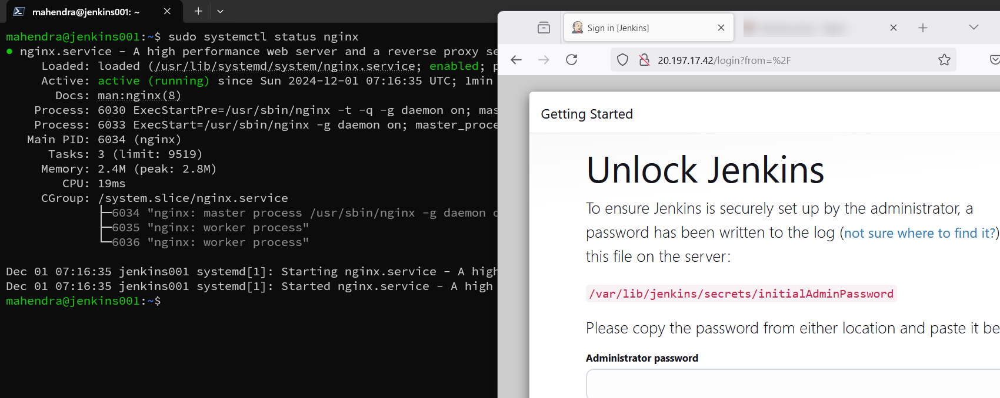

1.  Go back to terminal (ssh-client) and try getting initial password.

    ```bash
    sudo cat /var/lib/jenkins/secrets/initialAdminPassword
    ```

    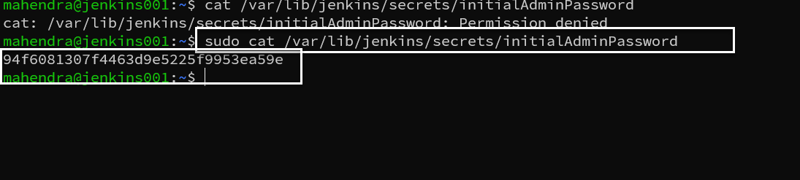

1.  Copy the password from terminal (Use right click, DON'T USE CTRL+C )

1.  Paste the password in web-browser textfield. Click Next button to continue.

    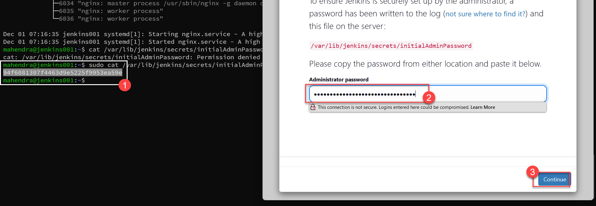

1.  Click "Install Suggested plugins" and then continue to "Admin User Creation" panel.

    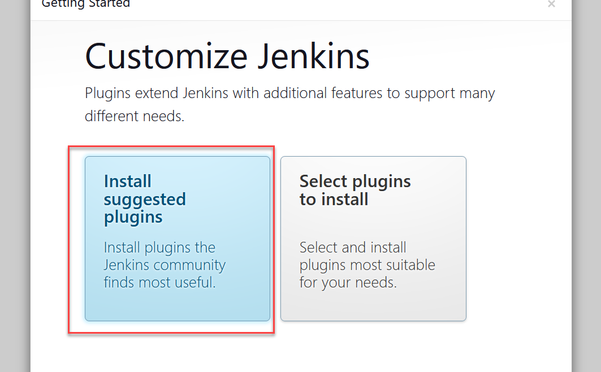

1.  Create a new admin-user (I have created user `mahendra`). And remeber this user and password for later use.

    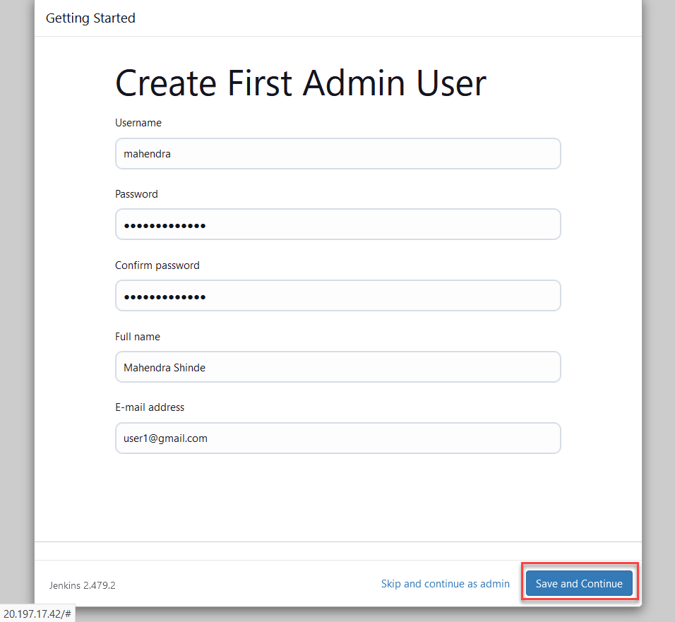

1.  Now, Accept the default jenkins URL to continue using jenkins.

    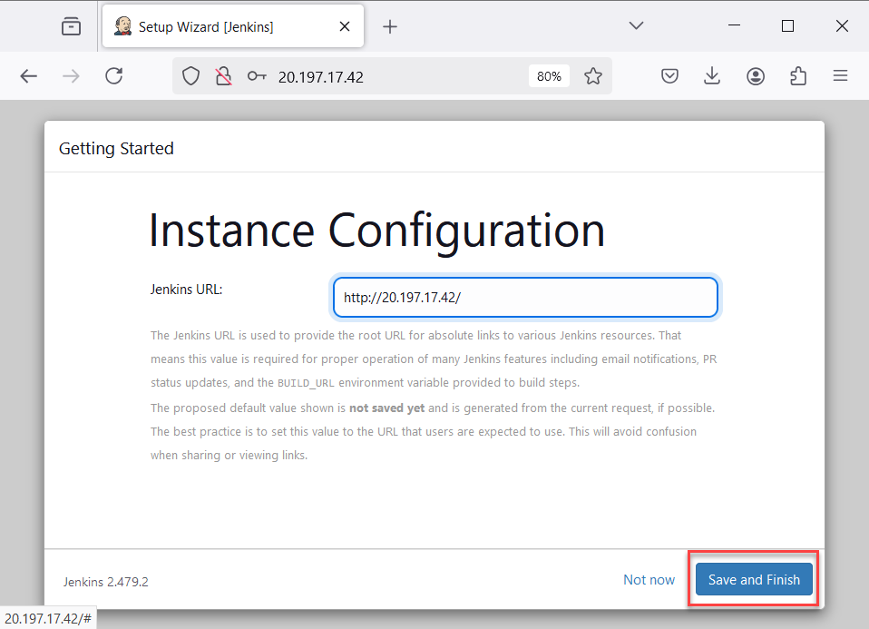

1.  On last screen, just click continue for Jenkins dashboard. Jenkins dashboard sould look like this one.

    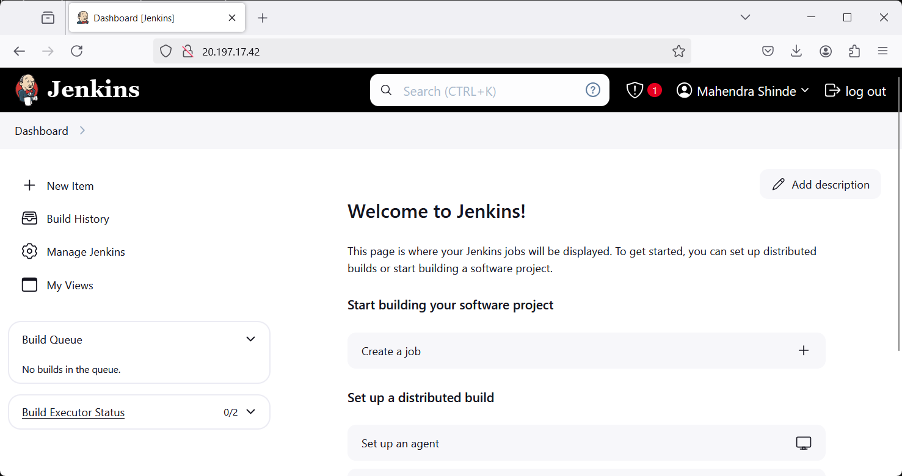


## Installing Docker and allow `jenkins` to access `Docker Daemon`

1.  Install the default docker package `docker.io` using APT cli.

    ```
    sudo apt install docker.io -y
    sudo systemctl status docker
    ```

1.  Add current user and `jenkins` user to the group `docker` 

    > This would allow `jenkins` service to access `docker` daemon.

    ```bash
    sudo usermod -aG docker $USER
    sudo usermod -aG docker jenkins
    ```

1.  Now, install a new plugins in jenkins (docker and docker pipeline)

    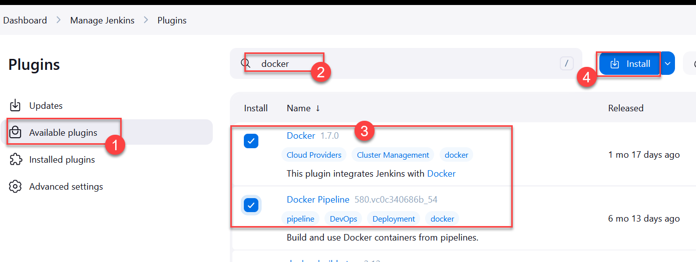

1.  From `Jenkins Manager` click on button `Set up cloud`

    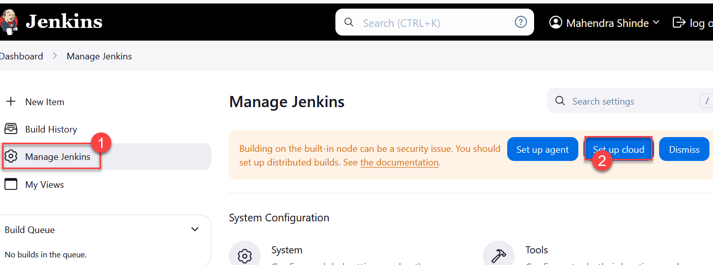

1.  Enter name `docker` and select `type` as `Docker` then click `Create`

    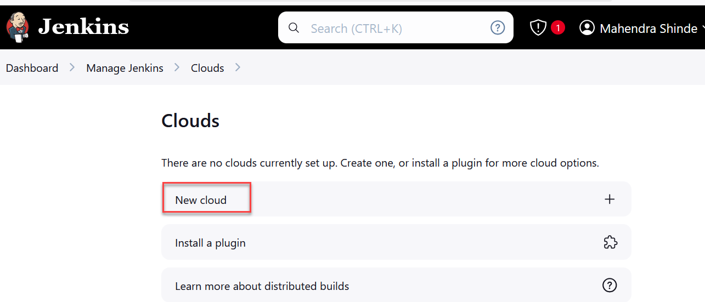

1.  Click on `Docker cloud details` then provide `Docker Host URI`  as `unix:///var/run/docker.sock` use checkbox `Enable` and then click `Test Connection`

    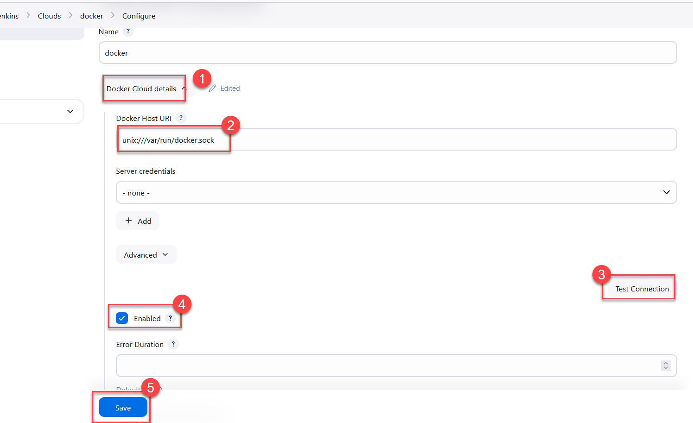

## A Demo 

1.  Create a new freestyle project in Jenkins with name `job1`

1.  In `Source Code Management` select `Git` and then use URL of github repository.

    You may use your own repository or this one `https://github.com/mahendra-shinde/ci-servlet-demo`

    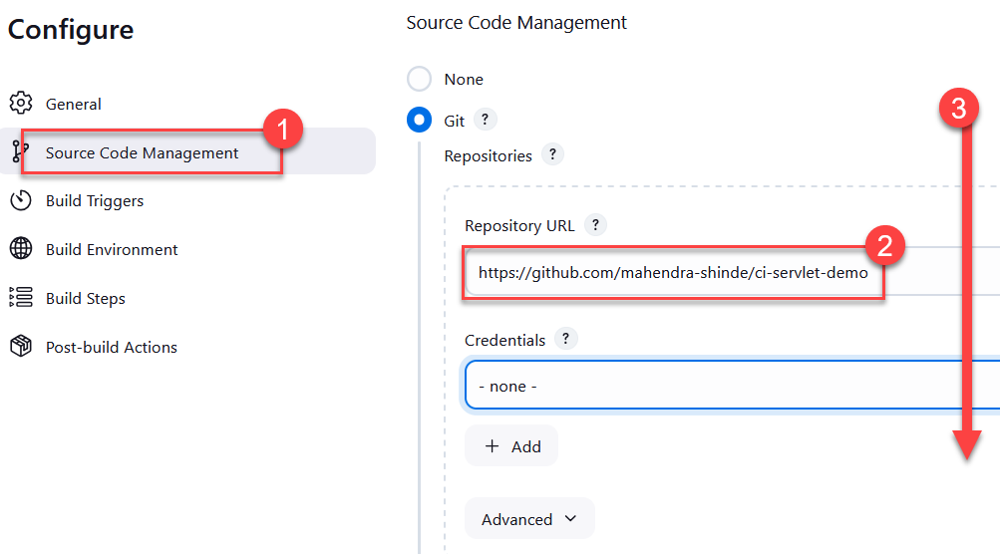

1.  Scroll down and now add new build step `Build / Publish Docker Image`

    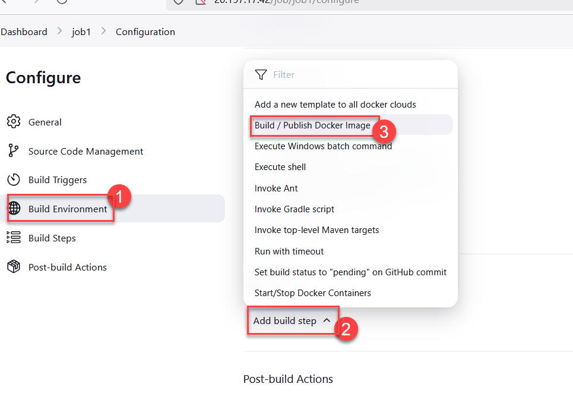

1.  select the cloud name as `docker` and provide name for local image `test1` then click `Save`

    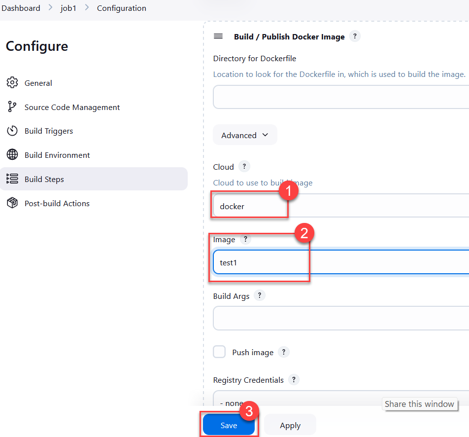

1.  After Job is created, click `Build Now` button to test the job.

1.  Job should be completed successfuly !

    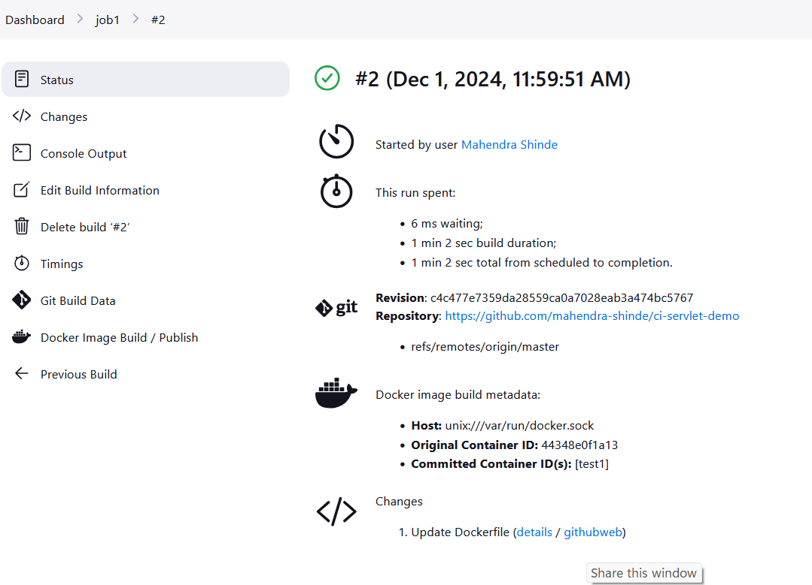
    